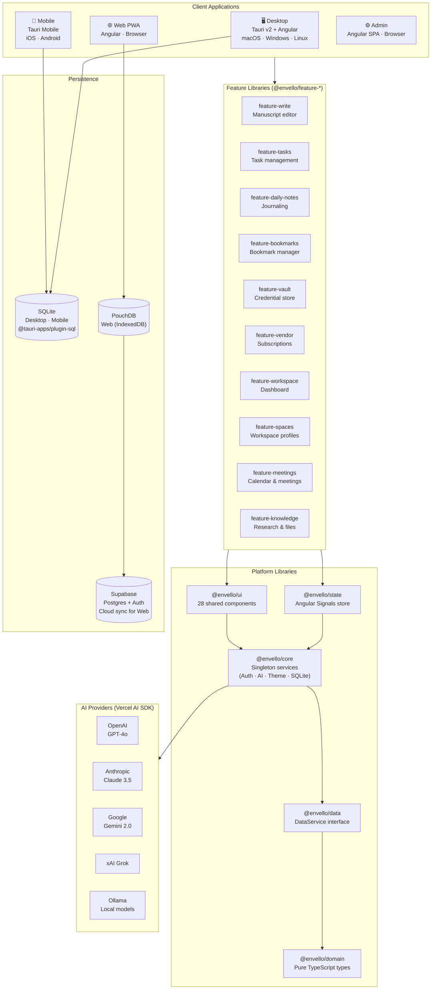
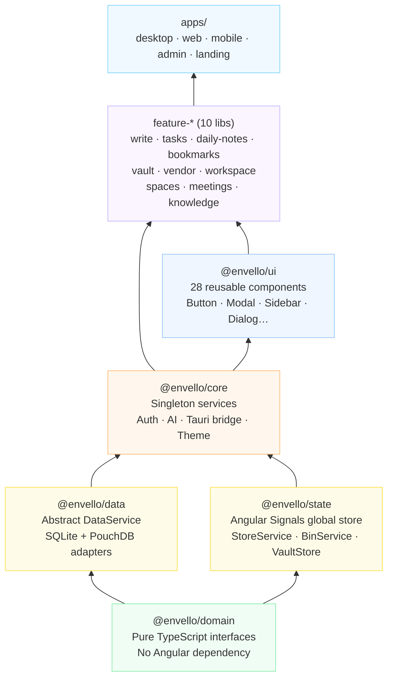
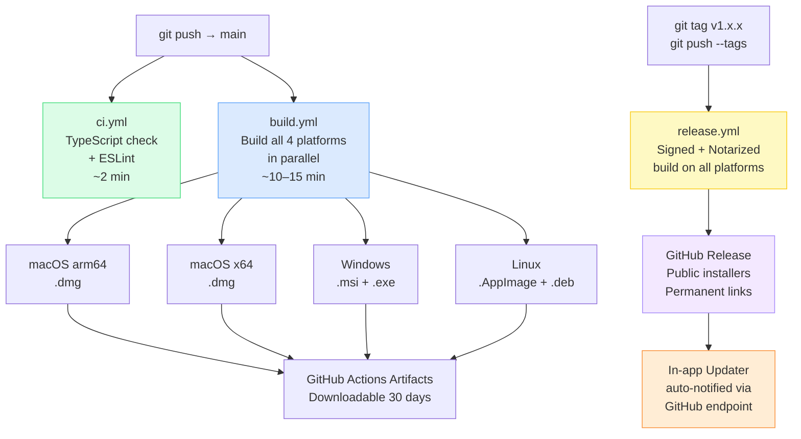

# Envello

> A distraction-free productivity and creative writing workspace — built for writers, developers, and solo operators.

Envello combines **long-form writing**, **task management**, **daily notes**, **research organization**, **project tracking**, **bookmark management**, and **credential vaulting** into a single desktop-first application with full web and mobile support.

---

## Architecture Overview



---

## Library Dependency Layers



---

## CI/CD Pipeline



---

## Apps

| App | Platform | Port | Description |
|-----|----------|------|-------------|
| `desktop` | Tauri v2 + Angular — macOS / Windows / Linux | 4200 | Native desktop app with SQLite persistence |
| `web` | Angular PWA — Browser | 4200 | Web app with PouchDB (IndexedDB) + Supabase cloud sync |
| `mobile` | Tauri Mobile — iOS / Android | 4202 | Mobile app (Tauri iOS & Android targets) |
| `admin` | Angular SPA — Browser | 4201 | Admin dashboard — AI config, users, feature flags, usage |
| `landing` | Angular SPA — Browser | — | Marketing landing page |

---

## Features

### Write / Manuscript Editor (`feature-write`)

A full-featured long-form writing workspace supporting novels, short stories, articles, essays, scripts, poetry, blog posts, and research:

| Component | Description |
|-----------|-------------|
| **Manuscript editor** | Tiptap v3 rich-text editor — bold, italic, headings, tables, task lists, code blocks, images, YouTube embeds |
| **@mention characters** | Type `@` while writing to insert a linked character or location chip — autocomplete from your book's cast |
| **Chapter management** | Create, reorder (drag & drop), group into Acts/Parts, duplicate, bulk-move, bulk-delete |
| **Character details** | Name, role, archetype, occupation, age, aliases, motivation, flaw, arc, portrait image, tags, rich-text appearance & biography sections |
| **Location details** | Name, type (inline editable), climate, population, notable features, story significance, icon picker, tags, rich-text description |
| **Character relationships** | SVG radial graph showing character connections with labelled edges |
| **Front matter & Prologue** | Title page, copyright, TOC, dedication, foreword, preface |
| **Synopsis** | Logline + theme |
| **Notes** | Chapter-linked editor notes |
| **Version history** | Per-chapter snapshots with restore |
| **Word count & goals** | Live word count, daily writing goal progress |
| **Focus mode** | Distraction-free full-screen writing |
| **Export** | Chapter export as Markdown |
| **Keyboard shortcuts panel** | `?` to open all shortcuts |

### Tasks (`feature-tasks`)

Full task management with priority, due dates, subtasks, dependencies, recurring patterns, Pomodoro timer, focus mode, timeline view, voice input, AI assistant, and undo/redo.

### Daily Notes (`feature-daily-notes`)

Rich-text journaling with Tiptap editor (tables, task lists, code blocks, images, YouTube embeds), folder-based organization, AI note generation, and note backgrounds.

### Bookmarks (`feature-bookmarks`)

Bookmark manager with table/grid views, folder organization, pinning, archiving, tagging, color accents, and AI integration.

### Vault (`feature-vault`)

Encrypted credential manager for logins, API keys, SSH keys, database connections, and secure notes.

### Vendors (`feature-vendor`)

Subscription/vendor tracker with ~60 vendor presets, billing cycles, cost calculation, and renewal reminders.

### Workspace (`feature-workspace`)

Main dashboard hub with overview, recent activity, voice input, quick-add command bar, and CPU/latency metrics.

---

## Tech Stack

| Layer | Technology | Version |
|-------|-----------|---------|
| Frontend | Angular (Standalone Components + Signals) | v20 |
| Desktop/Mobile runtime | Tauri (Rust + Webview) | v2 |
| Styling | TailwindCSS + CSS Custom Properties | v4 |
| Rich-text editor | Tiptap (16+ extensions incl. @mention) | v3 |
| AI orchestration | Vercel AI SDK (8 providers) | latest |
| Desktop database | SQLite via `@tauri-apps/plugin-sql` | — |
| Web database | PouchDB + Supabase | — |
| Backend / Auth | Supabase (Postgres, RLS, Realtime) | v2 |
| Monorepo build | Nx | v22 |
| State management | Angular Signals (no NgRx) | — |

---

## Monorepo Structure

```
envello/
├── apps/
│   ├── desktop/            # Tauri desktop app
│   │   └── src-tauri/      # Rust backend (moved from root in earlier sessions)
│   ├── web/                # Angular PWA
│   ├── mobile/             # Tauri mobile (iOS + Android)
│   │   └── src-tauri/      # Mobile Rust backend
│   ├── admin/              # Admin dashboard
│   └── landing/            # Marketing page
│
├── libs/
│   ├── domain/             # Pure TS interfaces: Task, Note, Book, Project, Character…
│   ├── data/               # Persistence abstraction (SQLite / PouchDB adapters)
│   ├── state/              # Global Signals store: StoreService, BinService, VaultStore
│   ├── core/               # Singleton services: Auth, AI, Theme, Tauri bridge, SQLite
│   ├── ui/                 # ~28 reusable standalone Angular components
│   ├── feature-write/      # Long-form writing workspace (novels, essays, scripts…)
│   ├── feature-tasks/      # Task management
│   ├── feature-daily-notes/# Journaling
│   ├── feature-bookmarks/  # Bookmark manager
│   ├── feature-vault/      # Credential vault
│   ├── feature-vendor/     # Subscription tracker
│   ├── feature-workspace/  # Dashboard hub
│   ├── feature-spaces/     # Workspace profiles
│   ├── feature-meetings/   # Calendar & meetings
│   └── feature-knowledge/  # Research collections & files
│
├── src-tauri/              # Rust backend (Tauri v2) — desktop
├── supabase/
│   └── migrations/         # SQL: profiles, AI config, feature flags, usage logs
│
└── .github/
    └── workflows/
        ├── ci.yml          # TypeScript check + lint (every push/PR)
        ├── build.yml       # Build all platforms → artifacts (every push to main)
        └── release.yml     # Signed release (on version tag)
```

---

## Development

### Prerequisites

| Tool | Version | Required for |
|------|---------|-------------|
| Node.js | v22+ | All |
| npm | v10+ | All |
| Rust (stable) | latest | Desktop + Mobile builds |
| Xcode | latest | iOS builds |
| Android Studio + NDK | latest | Android builds |

```bash
# Install Node dependencies
npm install

# Install Rust (if not already installed)
curl --proto '=https' --tlsv1.2 -sSf https://sh.rustup.rs | sh
```

---

## Commands

> All commands use `npm exec nx`. Never invoke `ng`, `jest`, or `tsc` directly.

### Dev Servers

```bash
# Desktop — browser-only preview (fast, no Rust compile)
npm exec nx serve desktop

# Desktop — native Tauri window (compiles Rust + opens OS window)
npm exec tauri dev

# Web PWA
npm exec nx serve web

# Mobile — browser preview
npm exec nx serve mobile

# Admin dashboard
npm exec nx serve admin
```

### Build

```bash
# Desktop frontend (Angular only)
npm exec nx build desktop

# Desktop native binary (.dmg / .exe / .AppImage)
npm exec tauri build

# Web PWA
npm exec nx build web

# Build everything
npm exec nx run-many --target=build --all
```

### Test

```bash
npm exec nx test desktop
npm exec nx test web
npm exec nx test feature-tasks
```

### Lint & Format

```bash
npm exec nx run-many --target=lint
npm exec nx format:write
```

### Other

```bash
# Interactive dependency graph
npm exec nx graph

# Regenerate AI context file
npm run generate:context
```

---

## CI/CD

Three GitHub Actions workflows run automatically:

### `ci.yml` — on every push and PR to `main`
Fast feedback: TypeScript check + ESLint. Runs in ~2 minutes.

### `build.yml` — on every push to `main`
Builds the desktop app on all 4 platforms in parallel. Produces downloadable artifacts in the Actions tab (kept 30 days). No git tag required.

### `release.yml` — on version tags

```bash
# Bump version in tauri.conf.json, then:
git tag v0.2.0
git push --tags
```

Builds signed + notarized installers on all platforms, creates a GitHub Release with public download links, and notifies the in-app updater.

### Required GitHub Secrets

Go to **Settings → Secrets and variables → Actions** and add:

| Secret | Purpose |
|--------|---------|
| `TAURI_SIGNING_PRIVATE_KEY` | Signs update bundles (already generated) |
| `TAURI_SIGNING_PRIVATE_KEY_PASSWORD` | Password for the signing key |
| `APPLE_CERTIFICATE` | Base64-encoded `.p12` — Apple Distribution cert |
| `APPLE_CERTIFICATE_PASSWORD` | `.p12` export password |
| `APPLE_SIGNING_IDENTITY` | e.g. `Developer ID Application: Name (TEAMID)` |
| `APPLE_ID` | Apple developer email |
| `APPLE_ID_PASSWORD` | App-specific password from appleid.apple.com |
| `APPLE_TEAM_ID` | 10-char team ID from developer.apple.com |

---

## Publishing

### macOS App Store

1. Create App ID `com.envello.app` in Apple Developer portal
2. Generate **Apple Distribution** + **Mac Installer Distribution** certificates
3. Add `Entitlements.plist` with App Sandbox entitlements
4. Set `"macOSPrivateApi": false` (or justify its use in review notes)
5. Disable `plugins.updater` for App Store builds (App Store handles updates)
6. Build: `npm exec tauri build -- --config tauri.appstore.conf.json`
7. Package: `productbuild --component Envello.app /Applications --sign "3rd Party Mac Developer Installer: ..." Envello.pkg`
8. Upload via **Transporter**, then submit in **App Store Connect**

### Microsoft Store

1. Register in **Microsoft Partner Center**, reserve app name "Envello"
2. Build on Windows: `npm exec tauri build`
3. Convert `.msi` to `.msix` using the **MSIX Packaging Tool** (free from Microsoft Store)
4. Associate the MSIX with your Partner Center listing
5. Upload in Partner Center → New submission → Packages
6. Review: 3–5 business days

---

## Themes

7 runtime-switchable themes:

| Theme | Style |
|-------|-------|
| Kindle Paperwhite | Warm matte paper, amber accent — desktop default |
| Enterprise Dark | Zinc dark, gold accent — web default |
| Dark | True black, gold accent |
| Light | Clean paper aesthetic |
| Colorful | White background, vibrant palette |
| Typewriter | Minimal monochrome, warm paper |
| Enterprise Light | Professional with subtle gradients |

---

## AI Integration

Multi-provider AI assistant powered by the Vercel AI SDK. Platform admin sets a default provider + API key; users can override with their own key (BYOK) and configure different models per feature (writing, research, summarise, chat).

| Provider | Models |
|----------|--------|
| OpenAI | gpt-4o, gpt-4o-mini, o1-mini |
| Anthropic | claude-opus-4-6, claude-sonnet-4-6, claude-haiku-4-5 |
| Google | gemini-2.5-pro, gemini-2.5-flash |
| xAI | grok-3, grok-3-mini |
| DeepSeek | deepseek-chat, deepseek-reasoner (R1) |
| Ollama | Local models (llama3, mistral, gemma3…) |
| On-Device | HuggingFace Transformers.js (ONNX, no API key) |
| Demo | Mock mode — no key required |

---

## Admin Dashboard

Accessible at `/admin`. Requires `role = 'admin'` in the Supabase `profiles` table.

```sql
-- Bootstrap first admin (run in Supabase Dashboard → SQL Editor)
UPDATE public.profiles SET role = 'admin' WHERE id = '<your-user-uuid>';
-- Get your UUID: SELECT id, email FROM auth.users;
```

| Page | Description |
|------|-------------|
| Dashboard | Users, AI requests, active flags, recent activity |
| AI Settings | Platform provider, model, API key, global AI toggle |
| Users | View all users, promote to admin, suspend accounts |
| Usage | AI usage logs by user/provider/time; CSV export |
| Feature Flags | Toggle platform features globally |

---

## Documentation

| File | Description |
|------|-------------|
| [DOCUMENTATION.md](./DOCUMENTATION.md) | Detailed architecture and dev workflow |
| [CHANGELOG.md](./CHANGELOG.md) | Release history |
| [AI_CONTEXT.md](./AI_CONTEXT.md) | Auto-generated API surface for LLM agents |
| [AGENTS.md](./AGENTS.md) | Nx workspace agent instructions |
| [supabase/migrations/](./supabase/migrations/) | Database schema migrations |

---

## License

Proprietary — All rights reserved.
