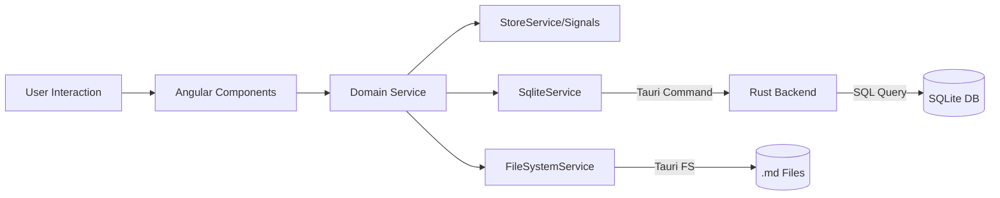
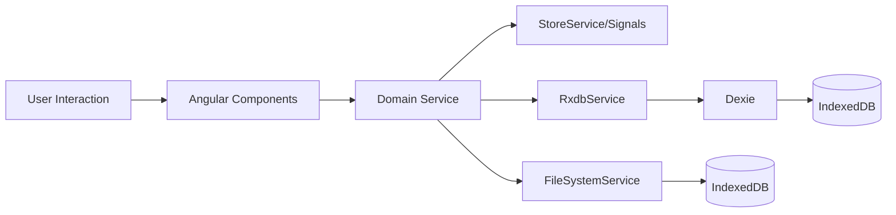

# Envello

Envello is a powerful, distraction-free note-taking and productivity application designed for writers, researchers, and developers. Built with modern web technologies and wrapped in a native shell, it combines the flexibility of the web with the performance of a desktop application.

 *Add a banner image if available*

## 🚀 Features

Envello is organized into specialized modules to cater to different creative and productive needs:

-   **📖 Novels & Fiction:** A dedicated writing environment for long-form fiction with chapter management.
-   **🔬 Research:** Organize sources, citations, and research notes.
-   **📝 Daily Notes:** Capture fleeting thoughts and daily logs.
-   **✅ Tasks & Todos:** Integrated task management to keep you on track.
-   **📅 Meetings:** Record meeting notes and action items.
-   **📚 Books/Reading:** Track your reading list and book notes.
-   **💻 Code Snippets:** Store and manage useful code blocks.
-   **📔 Journals:** Personal journaling and reflection.
-   **✍️ Articles/Blogs:** Draft and manage blog posts and articles.
-   **🤖 AI Assistance:** Integrated AI tools for drafting and brainstorming.

## 📚 Documentation

Comprehensive documentation is available for understanding the complete architecture and data flow:

### Quick Start
- **[DOCUMENTATION_INDEX.md](./DOCUMENTATION_INDEX.md)** - Start here! Navigation guide for all documentation
- **[envello_architecture_diagram.png](./envello_architecture_diagram.png)** - Visual architecture diagram

### Detailed Documentation
- **[DATA_FLOW_DOCUMENTATION.md](./DATA_FLOW_DOCUMENTATION.md)** - Complete data flow for all pages and features (~15,000 words)
- **[ARCHITECTURE_SUMMARY.md](./ARCHITECTURE_SUMMARY.md)** - Quick reference guide with tables and diagrams (~5,000 words)
- **[FEATURE_COMPARISON.md](./FEATURE_COMPARISON.md)** - Detailed comparison between Web and Desktop versions (~8,000 words)

### What's Documented
- ✅ All 13+ pages/features with complete data flow
- ✅ All 15+ core services with responsibilities
- ✅ 17 data collections (tasks, notes, novels, etc.)
- ✅ Web vs Desktop differences and comparisons
- ✅ Performance optimizations and security considerations
- ✅ Future roadmap and critical issues

### Documentation Highlights
- **For Developers**: Complete technical deep-dive with service architecture
- **For Product Managers**: Feature matrices and platform comparisons
- **For Designers**: Page-by-page UI/UX flow documentation
- **For DevOps**: Deployment strategies and infrastructure details

## 🏗 Architecture & Tech Stack

Envello is a **dual-platform application** with both Web and Desktop versions, using a hybrid architecture leveraging the robustness of Rust (Desktop) and the agility of Angular.

### Technology Stack

#### Shared Technologies
-   **Frontend Framework:** Angular 20 (Standalone Components, Signals, Reactive Forms)
-   **Rich Text Editor:** TiptapEditor (Prosemirror-based)
-   **State Management:** Angular Signals (reactive)
-   **Markdown:** `marked` (MD→HTML), `turndown` (HTML→MD)
-   **AI Integration:** LangChain.js (OpenAI, Anthropic, Ollama)
-   **Styling:** Modern CSS3 with CSS Variables for theming (Dark/Light mode support)

#### Desktop (Tauri) Specific
-   **Runtime:** Tauri v2 (Rust-based)
-   **Database:** SQLite (via Tauri plugin)
-   **File System:** Native FS (via Tauri plugin)
-   **Authentication:** Supabase + Guest Mode
-   **Notifications:** Tauri notification plugin
-   **Storage Location:** Tauri app data directory

#### Web (Browser) Specific
-   **Database:** RxDB with Dexie (IndexedDB wrapper)
-   **File System:** Browser File System API + IndexedDB fallback
-   **Authentication:** Stub (development mode)
-   **Notifications:** Browser Notification API
-   **Storage Location:** Browser IndexedDB

### High-Level Architecture

The application follows a modular, service-based architecture with clear separation between platforms:

#### Desktop Architecture
```
User → Angular Components → Domain Services → StoreService
  → SqliteService → Tauri SQL Plugin → SQLite DB
  → FileSystemService → Tauri FS Plugin → Native Files (.md)
```

#### Web Architecture
```
User → Angular Components → Domain Services → StoreService
  → RxdbService → RxDB → Dexie → Browser IndexedDB
  → FileSystemService → Browser FS API → IndexedDB
```

### Architectural Layers

1.  **UI Components (`apps/desktop/src/app/components/` or `apps/web/src/app/components/`)**:
    -   Purely presentational or container components.
    -   Interact exclusively with **Domain Services**.
    -   Lazy-loaded via the Router for optimal performance.

2.  **Domain Services (`apps/desktop/src/app/services/` or `apps/web/src/app/services/`)**:
    -   Handle business logic for specific features (e.g., `NovelContentService`, `JournalService`, `TaskService`).
    -   Manage state using **Angular Signals** for reactive updates.
    -   Serve as the bridge between UI and Data layers.
    -   **Shared across both platforms** with identical business logic.

3.  **Core Services (`apps/desktop/src/app/core/` or `apps/web/src/app/core/`)**:
    -   **Desktop Core Services**:
        -   **`SqliteService`**: Manages all database interactions with SQLite (17 tables).
        -   **`FileSystemService`**: Native file system access via Tauri (`.md` files for notes).
        -   **`AuthService`**: Supabase authentication + Guest mode.
        -   **`SupabaseService`**: Supabase client wrapper.
        -   **`TauriService`**: Handles bridge commands between webview and Rust backend.
        -   **`LoggingService`**: Centralized logging for debugging.
    -   **Web Core Services**:
        -   **`RxdbService`**: Manages all database interactions with RxDB/IndexedDB (17 collections).
        -   **`FileSystemService`**: Browser File System API + IndexedDB fallback.
        -   **`AuthService`**: Stub authentication (development mode).
        -   **`LoggingService`**: Centralized logging for debugging.

### Data Flow

#### Desktop Data Flow


#### Web Data Flow


## 🛠 Development

### Prerequisites

-   **Node.js**: v20+
-   **npm**: v9+
-   **Rust**: Latest stable (for Tauri development)

### Installation

```bash
# Install NPM dependencies
npm install

# Check Rust environment (if developing backend)
cargo --version
```

### Running Locally

#### Desktop (Tauri)
```bash
# Run the desktop application (default port 4200)
npm run dev
# or
npm run start

# Run on a specific port
npm run dev -- --port 4202

# Run the full Tauri application (requires Rust)
npm run tauri dev
```

#### Web (Browser)
```bash
# Run the web application (default port 4200)
npm run start:web

# Run on a specific port
npm run start:web -- --port 4201
```

## 📦 Build & Deployment

### Desktop (Tauri)
| Command | Description | Output |
| :--- | :--- | :--- |
| `npm run build` | Standard desktop build | `dist/apps/desktop/browser` |
| `npm run build:prod` | Production optimized desktop build | `dist/apps/desktop/browser` |
| `npm run build:staging` | Staging build | `dist/apps/desktop/browser` |
| `npm run tauri build` | Build native desktop binaries | `src-tauri/target/release/bundle` |

### Web (Browser)
| Command | Description | Output |
| :--- | :--- | :--- |
| `npm run build:web` | Production web build | `dist/apps/web/browser` |

### Testing
| Command | Description |
| :--- | :--- |
| `npm run test` | Run desktop tests |
| `npm run test:web` | Run web tests |

## 📂 Project Structure

```
envello-app/
├── apps/
│   ├── desktop/                    # Desktop (Tauri) application
│   │   └── src/
│   │       ├── app/
│   │       │   ├── components/     # Feature modules (Workspace, Novels, Tasks, etc.)
│   │       │   ├── core/           # Core services (Auth, SQLite, FileSystem, Tauri)
│   │       │   ├── services/       # Domain-specific logic (shared with web)
│   │       │   └── app.routes.ts   # Desktop routing (includes /login, /workspace)
│   │       └── main.ts
│   └── web/                        # Web (Browser) application
│       └── src/
│           ├── app/
│           │   ├── components/     # Feature modules (Overview, Novels, Tasks, etc.)
│           │   ├── core/           # Core services (RxDB, FileSystem)
│           │   ├── services/       # Domain-specific logic (shared with desktop)
│           │   └── app.routes.ts   # Web routing (starts at /overview)
│           └── main.ts
├── src-tauri/                      # Rust backend & Tauri configuration (desktop only)
├── dist/                           # Build artifacts
│   ├── apps/
│   │   ├── desktop/                # Desktop build output
│   │   └── web/                    # Web build output
├── DATA_FLOW_DOCUMENTATION.md      # Complete data flow documentation
├── ARCHITECTURE_SUMMARY.md         # Quick reference guide
├── FEATURE_COMPARISON.md           # Desktop vs Web comparison
├── DOCUMENTATION_INDEX.md          # Documentation navigation guide
├── envello_architecture_diagram.png # Visual architecture diagram
└── ...
```

## 🗺 Roadmap

See [ENTERPRISE_IMPROVEMENTS.md](./ENTERPRISE_IMPROVEMENTS.md) for our detailed roadmap towards enterprise-grade attributes, including:
-   Remote Sync & Cloud Backup
-   Enhanced Security & Encryption
-   CI/CD Pipelines
-   Internationalization (i18n)

## 📄 License

Proprietary/Private.
