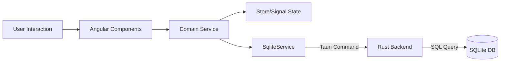

# Envello

Envello is a powerful, distraction-free note-taking and productivity application designed for writers, researchers, and developers. Built with modern web technologies and wrapped in a native shell, it combines the flexibility of the web with the performance of a desktop application.

 *Add a banner image if available*

## 🚀 Features

Envello is organized into specialized modules to cater to different creative and productive needs:

-   **📖 Novels & Fiction:** A dedicated writing environment for long-form fiction with chapter management.
-   **🔬 Research:** Organize sources, citations, and research notes.
-   **📝 Daily Notes:** Capture fleeting thoughts and daily logs.
-   **✅ Tasks & Todos:** Integrated task management to keep you on track.
-   **📅 Meetings:** Record meeting notes and action items.
-   **📚 Books/Reading:** Track your reading list and book notes.
-   **💻 Code Snippets:** Store and manage useful code blocks.
-   **📔 Journals:** Personal journaling and reflection.
-   **✍️ Articles/Blogs:** Draft and manage blog posts and articles.
-   **🤖 AI Assistance:** Integrated AI tools for drafting and brainstorming.

## 🏗 Architecture & Tech Stack

Envello uses a hybrid architecture leveraging the robustness of Rust and the agility of Angular.

### Technology Stack

-   **Frontend:** Angular 19+ (Standalone Components, Signals, Reactive Forms)
-   **Backend/Native Shell:** Tauri (Rust) for cross-platform desktop capability.
-   **Database:** SQLite (Local storage for robust data persistence).
-   **Styling:** Modern CSS3 with CSS Variables for theming (Dark/Light mode support).

### High-Level Architecture

The application follows a modular, service-based architecture:

1.  **UI Components (`apps/web/src/app/components/`)**:
    -   Purely presentational or container components.
    -   Interact exclusively with **Domain Services**.
    -   Lazy-loaded via the Router for optimal performance.

2.  **Domain Services (`apps/web/src/app/services/`)**:
    -   Handle business logic for specific features (e.g., `NovelService`, `TaskService`).
    -   Manage state using **Angular Signals** for reactive updates.
    -   Serve as the bridge between UI and Data layers.

3.  **Core Core (`apps/web/src/app/core/`)**:
    -   **`SqliteService`**: Manages all database interactions, executing queries against the local SQLite DB.
    -   **`TauriService`**: Handles bridge commands between the webview and the Rust backend.
    -   **`AuthService`**: Manages user session and authentication states.
    -   **`LoggingService`**: Centralized logging for debugging and monitoring.

### Data Flow



## 🛠 Development

### Prerequisites

-   **Node.js**: v20+
-   **npm**: v9+
-   **Rust**: Latest stable (for Tauri development)

### Installation

```bash
# Install NPM dependencies
npm install

# Check Rust environment (if developing backend)
cargo --version
```

### Running Locally

```bash
# Run the web application in browser mode (mocked backend)
npm run dev

# Run the full desktop application (requires Rust)
npm run tauri dev
```

## 📦 Build & Deployment

| Command | Description | Output |
| :--- | :--- | :--- |
| `npm run build` | Standard web build | `dist/apps/desktop/browser` |
| `npm run build:prod` | Production optimized web build | `dist/apps/desktop/browser` |
| `npm run tauri build` | Build native desktop binaries | `src-tauri/target/release/bundle` |

## 📂 Project Structure

```
envello/
├── apps/
│   └── web/
│       └── src/
│           ├── app/
│           │   ├── components/  # Feature modules (Novels, Tasks, etc.)
│           │   ├── core/        # Singleton services (Auth, SQLite, Error Handling)
│           │   ├── services/    # Domain-specific logic
│           │   └── ...
│           └── ...
├── src-tauri/                   # Rust backend & Tauri configuration
├── dist/                        # Build artifacts
└── ...
```

## 🗺 Roadmap

See [ENTERPRISE_IMPROVEMENTS.md](./ENTERPRISE_IMPROVEMENTS.md) for our detailed roadmap towards enterprise-grade attributes, including:
-   Remote Sync & Cloud Backup
-   Enhanced Security & Encryption
-   CI/CD Pipelines
-   Internationalization (i18n)

## 📄 License

Proprietary/Private.
